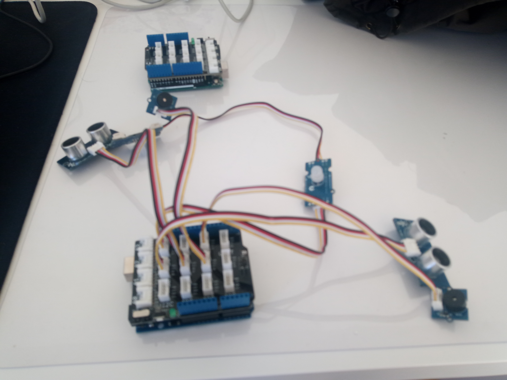

# Casque_Intelligent

Mais keskessé ???

Un casque qui détecte des objets environnant sur la droite ou la gauche.

Equipement nécessaire:

- Carte arduino + support
- x2 capteur ultra son (Grove Ultrasonic Ranger)
- x2 buzzer (Grove buzzer)
- x2 ChainableLed (Grove Chainable RGB Led)
- 1 Cable USB vers carte arduino

Les librairies suivantes:

- ChainableLED
- Ultrasonic

Montage (image):

- Brancher les deux capteurs ultrason sur D8 et D7
- Brancher les deux buzzer sur D6 et D2
- Brancher une led sur D4 et brancher la suivante sur le OUT de celle ci au IN de la dernière
- Envoyer le code depuis Arduino IDE avec le Cable USB et en selectionnant le bon port
- Enjoy

Facts:

- Développé en C++ pour un projet de mon lycée (ArduBlock Education c'est trop moche)
